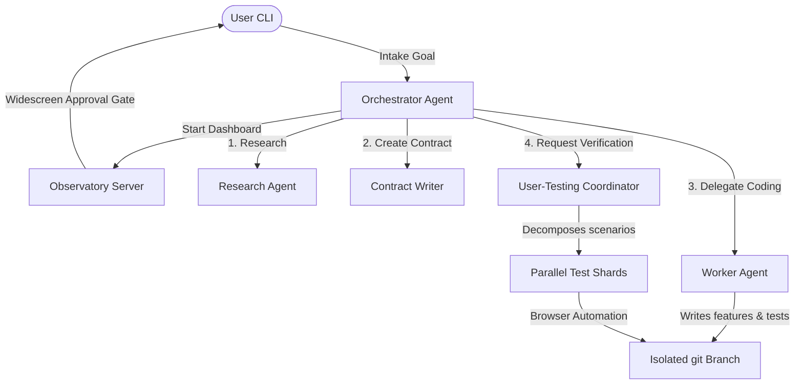

<p align="center">
  
</p>

<h1 align="center">Ratel</h1>

<p align="center">
  <strong>Thin deterministic orchestration + model-owned implementation for autonomous software missions</strong>
</p>

<p align="center">
  <a href="https://nodejs.org"></a>
  <a href="https://www.typescriptlang.org"></a>
  <a href="https://github.com/earendil-works/pi-coding-agent"></a>
</p>

<p align="center">
  ⭐ If you like this project, star it on GitHub!
</p>

<p align="center">
  <a href="#what-is-ratel">What is Ratel?</a> •
  <a href="#key-features">Key Features</a> •
  <a href="#quick-start">Quick Start</a> •
  <a href="#architecture">Architecture</a> •
  <a href="#how-it-works">How It Works</a> •
  <a href="#configuration">Configuration</a> •
  <a href="#development">Development</a>
</p>

---

## What is Ratel?

Ratel is an **AI Software Factory** — a framework designed for running autonomous, end-to-end software development missions. It orchestrates specialised LLM agents to plan, implement, and validate software projects while maintaining strict, deterministic control over process scheduling, repository isolation, schema validation, persistence, and branch integration.

> [!IMPORTANT]
> **Core Philosophy:** 
> * **Deterministic Code** owns the structural framework: database schemas, local persistence, execution timeouts, agent routing, and completion logic.
> * **Model Agents** own the cognitive work: task planning, source implementation, test creation, code reviews, and product judgment.
> * **Non-Bypassable Gates** ensure that features can only be merged into the main codebase when they pass all validators with zero high-severity issues.

---

## Key Features

*   ⚙️ **Deterministic Process Control** — Rigid validation gates, timeouts, and state machines ensure agent pipelines are stable and reproducible.
*   🛰️ **Live Observatory Dashboard** — Web-based monitoring interface showing live timelines, stdout streams, active git diffs, and validation feedback.
*   📄 **Interactive Widescreen Plan Review** — Review and modify the generated validation contracts and Gherkin feature files in real-time from your browser before launching missions.
*   🛠️ **Automated Sharded Testing** — Coordinates parallel user-testing shards to run automated browser and integration scenarios in isolated environments.
*   🔄 **Automatic Validation Recovery** — Identifies and attempts automatic correction of compilation, lint, or runtime errors before submitting final reports.

---

## Quick Start

### Prerequisites

*   Node.js 18+ and `npm`
*   Git
*   *(Optional)* API keys for OpenAI, Anthropic, or local LLMs running via Ollama

### Installation

```bash
# Clone the repository
git clone <repository-url>
cd ratel-web

# Install package dependencies
npm install

# Build the TypeScript project
npm run build
```

### Running a Mission

1.  Start the factory in interactive developer mode:
    ```bash
    npm run dev
    ```
2.  The factory will enter the **Intake** phase and prompt you for a goal.
3.  Describe your requirements (e.g., *"A real-time currency calculator with visual charting"*).
4.  Ratel will compile constraints, generate Gherkin specifications, and boot the **Observatory Dashboard** at `http://localhost:8765`.
5.  Open the dashboard, review the plan and feature files, edit them if necessary, and click **Approve & Run Mission** to begin execution.

---

## Architecture

Ratel leverages a modular agent structure where a deterministic core manages state transitions, and specialised subagents coordinate coding and validation.



### Component Breakdown

| Component | Responsibility |
|---|---|
| **Orchestrator** | Coordinates the mission lifecycle, schedules agent tasks, and enforces step transitions. |
| **Research Agent** | Investigates the workspace code in a read-only environment to discover dependencies. |
| **Contract Writer** | Translates user requirements into a unified `validation-contract.md` and discrete `.feature` Gherkin specs. |
| **Worker Agent** | Implements the features in isolated branches following strict Test-Driven Development (TDD) principles. |
| **Scrutiny Validator** | Automatically builds, lints, and runs static analyses over the worker's changes. |
| **User-Testing Coordinator** | Shards Gherkin specifications and runs browser automation in parallel to verify end-to-end user flows. |
| **Observatory Dashboard** | Serves as the interactive web interface for timeline feeds, code diffing, and manual plan revision. |

---

## How It Works

### Mission Lifecycle Phases

1.  **Intake**: The orchestrator receives the goal specification from the user.
2.  **Discovery**: Agents inspect the directory structure and existing code libraries to ensure compatibility.
3.  **Clarification**: The system resolves ambiguous requirements through interactive CLI prompts.
4.  **Constraint Analysis**: Identifies technological boundaries, non-goals, and dependency requirements.
5.  **Validation Contract**: The contract agent drafts high-level verification criteria and details scenarios.
6.  **Feature Decomposition**: Deconstructs the contract into concrete feature directories with automated checks.
7.  **User Approval**: The user reviews the plan and feature specifications in the browser dashboard.
8.  **Execution**: Worker subagents code, write tests, and integrate features serially upon successful validations.

### Workspace Isolation

Ratel enforces rigorous Git safety gates to prevent agent-owned modifications from polluting your primary codebase:
*   The orchestrator auto-discovers or sets up a clean `integration` branch.
*   Worker agents spawn a separate feature branch (`feat/F1`, `feat/F2`, etc.) for each milestone.
*   A feature is only merged back to `integration` upon passing all security and execution checks.

### Feature Completion Gate

A feature is strictly blocked from completion unless the following requirements are met:
*   The worker submits a valid, parseable handoff report (`parseStatus: "ok"`).
*   No `leftUndone` items exist in the feature manifest.
*   Zero high-severity issues or compiler warnings are discovered by the validators.
*   Workspace finalization successfully completes a git merge.

---

## Configuration

Ratel is configured via a global `ratel.json` file in the root directory:

```json
{
  "name": "ratel",
  "version": "0.1.0",
  "orchestrator": {
    "model": "openai/gpt-4o",
    "thinkingLevel": "medium",
    "defaultSkills": [
      "grill-with-docs",
      "parallel-web-search"
    ]
  },
  "workers": {
    "model": "anthropic/claude-3-5-sonnet",
    "defaultTools": ["read", "bash", "edit", "write"]
  },
  "validators": {
    "model": "openai/gpt-4o",
    "defaultTools": ["read", "bash", "grep"]
  }
}
```

> [!TIP]
> Model configurations map to the Pi SDK registry. You can override active models per-session using the CLI `set_model` tool.

---

## Development

### Script Commands

| Command | Action |
|---|---|
| `npm run dev` | Runs the factory in interactive developer mode (using `tsx` wrapper). |
| `npm run build` | Compiles the TypeScript source files and assets to the `dist/` directory. |
| `npm start` | Boots the compiled production main script. |
| `npm test` | Runs the Node.js test suite over the test modules. |

### Project Structure

```
ratel-web/
├── src/                         # Factory source modules
│   ├── main.ts                 # Main entry point and lifecycle boot
│   ├── core/                   # Core deterministic engines and tools
│   ├── observatory/            # Web server and dashboard UI assets
│   └── adapters/               # Pi SDK integration wrapper
├── test/                        # Core unit and integration tests
├── docs/                        # Project documentation
│   └── superpowers/            # Design specifications and implementation plans
├── ratel.json                   # Main configurations configuration
└── package.json                 # Project dependencies and script declarations
```
